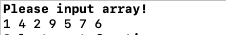
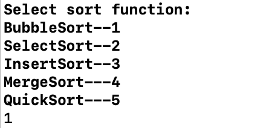
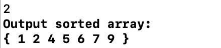
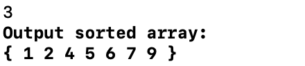
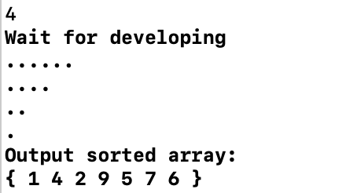
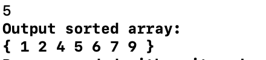

# ArraySort
实践十大排序算法，对数组中元素进行排序部分图片无法显示，更好体验可查看我的csdn博客[数组去重](https://blog.csdn.net/lrglgy/article/details/88110842)   
## 1.1 题目描述
**题目标题**：  
在实际编程中我们经常遇到“去掉重复数字”等类似的问题，也就是“Remove the duplicate”问题。例如在“建立某个统计样本时，要去掉重复的元素”。 

**详细描述**：  
输入：  
1 3 1 2 2 4 5 2  
输出：  
1 2 3 4 5

## 1.2 解答
### 1.2.1 方法解析
#### 1.2.1.1 题目分析
&nbsp;&nbsp;&nbsp;&nbsp;&nbsp;&nbsp;&nbsp;有如下几种情况：

1. 有序数组，不能额外申请空间 
2. 无序数组，不能额外申请空间 
3. 无序数组，可以额外申请空间

#### 1.2.1.2 算法分析
&nbsp;&nbsp;&nbsp;&nbsp;&nbsp;&nbsp;&nbsp;对于不能申请额外空间的有序数组，可以将未重复元素覆盖重复元素。设置基准指针和游标指针，基准指针标记向去重数组插入元素的位置，基准指针前的一段数组为去重数组。游标指针为遍历原数组的指针。  
&nbsp;&nbsp;&nbsp;&nbsp;&nbsp;&nbsp;&nbsp;对于不能申请额外空间的无序数组，可以先利用快速排序对原数组排序，然后再利用之前有序数组去重的方法进行去重。  
&nbsp;&nbsp;&nbsp;&nbsp;&nbsp;&nbsp;&nbsp;对于能申请额外空间的无序数组，可以额外申请其它容器或数据类型，利用额外申请的数据类型或容器自带的方法进行去重。此处采用了向量（vector）和（hash_set）。
#### 1.2.1.3 代码分析
参考代码注释
#### 1.2.1.4 结果
&nbsp;&nbsp;&nbsp;&nbsp;&nbsp;&nbsp;&nbsp;此处共使用四种方法进行去重，结果见下图：

 

方法一

方法二

方法三

方法四

## 1.3 参考
[《C++笔记》 Part8 删除数组中重复元素的算法（map））](https://blog.csdn.net/sinat_24206709/article/details/78725103)  
[算法12：删除数组中的重复元素](https://blog.csdn.net/pplin/article/details/62428699)  
[快速排序算法，C++ 递归实现](https://gist.github.com/Jack-Kingdom/f69e9974e9c40369689afd44ca4c3e7e)  
[C++ STL学习笔记十一 hash_set哈希集合容器](https://blog.csdn.net/cumirror/article/details/5596908)  
[Cannot find hash_map header under Mac OSX](https://stackoverflow.com/questions/4951194/cannot-find-hash-map-header-under-mac-osx)
