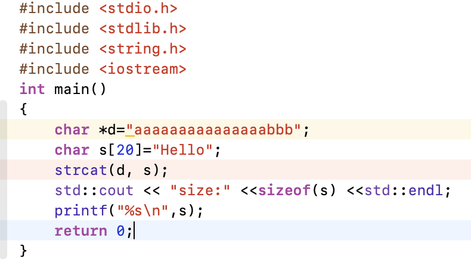
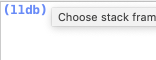
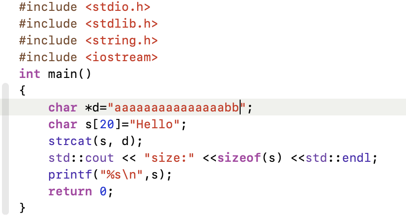
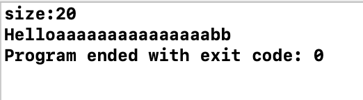
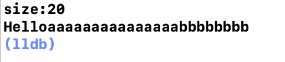

# 
第2章 Data

数据有关知识点总结
-------------------
## 2.1 数据的类型分类
### 2.1.1 基本数据类型
+ C的基本数据类型：
+ Python的基本数据类型：
+ Java的基本数据类型：

### 2.1.2 值类型与引用类型
&nbsp;&nbsp;&nbsp;&nbsp;&nbsp;&nbsp;&nbsp;&nbsp;在网上看到一句形容值类型与引用类型的话“值类型是现金，引用类型是存折”，个人认为非常贴切。这句话指明了引用类型表示储存数据的地址，而值类型就是地址当中的数据。  
&nbsp;&nbsp;&nbsp;&nbsp;&nbsp;&nbsp;&nbsp;&nbsp;具体区别及联系见下表：  

|			|值类型 			|引用类型		|
|-------- |:---------:  	|:-----:     |
|定义		|直接存储数据		|持有数据的引用	|
|存储		|栈（一声明就分配内存）					|堆（创建实例后才分配内存）				|
|例子		| 1.所有数字数据类型； 2.Boolean、Char 和 Date； 3.所有结构，即使其成员是引用类型； 4.枚举类型|1.string, class； 2.所有数组，即使其元素是值类型；				|
|equal用法	|比较的是二者的引用地址而不是内部的值|比较的是二者的值|
|垃圾回收(GS)|	栈不归GC管，所以作用范围一过，立即回收空间|劳烦GC动手|
**参考**  
[值类型和引用类型的区别](http://www.cnblogs.com/Autumoon/archive/2008/08/18/1270685.html)  
[值类型和引用类型](https://docs.microsoft.com/zh-cn/previous-versions/t63sy5hs(v=vs.120))  
[C#详解值类型和引用类型区别](https://blog.csdn.net/qiaoquan3/article/details/51202926)

## 2.2 数据结构分类
&nbsp;&nbsp;&nbsp;&nbsp;&nbsp;&nbsp;&nbsp;&nbsp;数据结构：是指相互之间存在着一种或多种关系的数据元素的集合和该集合中数据元素之间的关系组成。包括三个组成成分：数据的逻辑结构、物理结构（存储结构）、数据运算结构。
### 2.2.1 逻辑结构
链表，堆，栈，队列

### 2.2.2 物理结构

### 2.2.3 运算结构

**参考**  
[常用的数据结构有哪些](https://www.jianshu.com/p/0cc4b91b1a4c)  
[数据结构三要素：数据逻辑结构、数据存储结构和数据的运算](http://c.biancheng.net/cpp/html/2649.html)

## 2.2 数据的存储方式
### 2.2.1 堆与栈
### 2.2.2 树，表，图

## 2.1 `C#`特有数据类型
&nbsp;&nbsp;&nbsp;&nbsp;&nbsp;&nbsp;&nbsp;&nbsp;在C#中值类型的变量直接存储数据，而引用类型的变量持有的是数据的引用，数据存储在数据堆中。直白点儿说：值类型就是现金，要用直接用；引用类型是存折，要用还得先去银行取现。  

## 2.1 数据类型总览
+ 变量  
&nbsp;&nbsp;&nbsp;&nbsp;&nbsp;&nbsp;&nbsp;&nbsp;变量其实只不过是程序可操作的存储区的名称。类型决定了变量存储的大小和布局，该范围内的值都可以存储在内存中，运算符可应用于变量上。  
&nbsp;&nbsp;&nbsp;&nbsp;&nbsp;&nbsp;&nbsp;&nbsp;变量可以在三个地方被定义：1.在函数或一个代码块内部声明的变量，称为局部变量；2.在函数参数的定义中声明的变量，称为形式参数；3.在所有函数外部声明的变量，称为全局变量。  
[表格](http://www.runoob.com/cplusplus/cpp-variable-types.html)
+ 数组  
&nbsp;&nbsp;&nbsp;&nbsp;&nbsp;&nbsp;&nbsp;&nbsp;数组的声明并不是声明一个个单独的变量，比如 number0、number1、...、number99，而是声明一个数组变量，比如 numbers，然后使用 numbers[0]、numbers[1]、...、numbers[99] 来代表一个个单独的变量。数组中的特定元素可以通过索引访问。所有的数组都是由连续的内存位置组成。最低的地址对应第一个元素，最高的地址对应最后一个元素。
+ 指针  
&nbsp;&nbsp;&nbsp;&nbsp;&nbsp;&nbsp;&nbsp;&nbsp;指针是一个变量，其值为另一个变量的地址，即，内存位置的直接地址。就像其他变量或常量一样，您必须在使用指针存储其他变量地址之前，对其进行声明。
所有指针的值的实际数据类型，不管是整型、浮点型、字符型，还是其他的数据类型，都是一样的，都是一个代表内存地址的长的十六进制数。不同数据类型的指针之间唯一的不同是，指针所指向的变量或常量的数据类型不同。
+ **链表？？？？？？？？？？？？？？？？？？？？？？？**  

+ **列表？？？？？？？？？？？？？？？？？？？？？？？**  
&nbsp;&nbsp;&nbsp;&nbsp;&nbsp;&nbsp;&nbsp;&nbsp;参考：[Python 列表(List)](http://www.runoob.com/python/python-lists.html)  
+ **元组？？？？？？？？？？？？？？？？？？？？？？？**

## 2.2 指针与数组
### 2.2.1 比较总结   
char *a = "hello" 中的a是指向第一个字符‘a'的一个指针；  
char a[20] = "hello" 中数组名a也是执行数组第一个字符‘h’的指针；  
但二者并不相同：

&nbsp;&nbsp;&nbsp;&nbsp;&nbsp;&nbsp;&nbsp;字符指针a指向的内容存放在常量区，不可改变，长度在编译时固定（即定义时确定），详情见图一，二；  
&nbsp;&nbsp;&nbsp;&nbsp;&nbsp;&nbsp;&nbsp;而数组名a指向的内容存放在栈，可以改变，但是不能超出定义时的长度太多，否则会报错；长度在运行时确定（即输入时才确定），但通过sizeof()输出长度时时定义长度，详情见图三，四，五；
  

图一

  

图二

图三

  

图四

&nbsp;&nbsp;&nbsp;&nbsp;&nbsp;&nbsp;&nbsp;将d的长度再扩大一些，观察输出结果（超出s的长度太多会报错）：

图五

### 2.2.2 参考
[char *a 与char a[] 的区别和char** argv与char *argv[]区别](https://blog.csdn.net/u011068702/article/details/52588455)  

## 2.3 向量（Vector）与数组
### 2.3.1 比较总结
补充：数组可以从输入流中读入数据，而向量不可以
### 2.3.2 参考
[char *a 与char a[] 的区别和char** argv与char *argv[]区别](https://blog.csdn.net/u011068702/article/details/52588455) 

## 2.4 字符串与字符变量
+ 本质区别

1. char属于基础类型（C++)，char类型的长度是固定的，在C++中它可能是1个字节，或者2个字节（取决于是否为Unicode Char）。

2. string是一个模板类型，也就是一个class（C++)。string的长度是无法明确取得的。也就是无法通过sizeof来取得，因为它不是一个基础类型，它本身并不固定长度，而取决于内部包含的字符。

+ string存储类型

1. string中每个字符都用2个字节保存

2. string的最后还有一个特殊的字符，是不可见的，\0 。它也是占两个字节

3. string的大小是不可以通过sizeof来获得的。如果尝试通过sizeof取得string的大小，会遇到编译错误

## 2.5 不同类型的数据的存储方式
动态存储区分为堆和栈。都是程序执行的过程中动态分配的，大小也随之动态变化。从内存管理的实现的角度看来，堆使用的链表实现的，而栈使用的是线性存储的方法。  
全局变量存储在静态存储区中，  
静态变量（有`static`修饰）存储在静态存储区中，  
局部变量存储在动态存储区中，  
字符指针存储在静态存储区中，
## 2.6 参考
**操作系统层**  
(堆和栈比较)  
[动态存储和静态存储区域区别](https://blog.csdn.net/guosir_/article/details/78648064)  
[C/C++堆、栈及静态数据区详解
](http://www.cnblogs.com/hanyonglu/archive/2011/04/12/2014212.html)
[堆和栈的区别 之 数据结构和内存](https://blog.csdn.net/langb2014/article/details/79376349)  
(内存占用)  
[c++ 基本数据类型总结](https://blog.csdn.net/hf19931101/article/details/49491747)   
(列表，元组)   
[Python 列表(List)](http://www.runoob.com/python/python-lists.html)
  
**编程语言层**  
（不同编程语言中数据类型对比）  
[4种编程语言基本数据类型及其取值范围整理（C++,Java,Python,Go）](https://studygolang.com/articles/3790)
[C\C#\Java\Python 基本数据类型比较](https://blog.csdn.net/Solo95/article/details/50821352)  
（c#）  
(值类型与引用类型对比)  
[值类型和引用类型的区别](http://www.cnblogs.com/Autumoon/archive/2008/08/18/1270685.html)  
[C#详解值类型和引用类型区别](https://blog.csdn.net/qiaoquan3/article/details/51202926)

(学习数据当中有用的链接)  
[VisuAlgo](https://visualgo.net/zh)  

