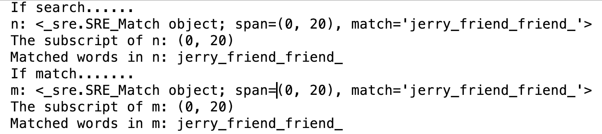
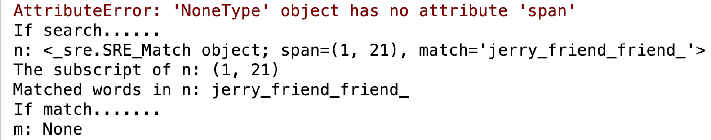

# <center>第1章 Python</center>
Python笔试知识点总结
-------------------
## 1.1 POST与GET区别
&nbsp;&nbsp;&nbsp;&nbsp;&nbsp;&nbsp;&nbsp;POST与GET都来源于HTTP协议，一个用于获取数据，另一个用于修改数据。  
## 1.2 Match与Search区别
&nbsp;&nbsp;&nbsp;&nbsp;&nbsp;&nbsp;&nbsp;Match与Search都是进行匹配。但Match是从string的0位置开始匹配，若初始位置匹配不成功，则报错。而Search是扫描整个string然后查找匹配。具体参考下图。  
&nbsp;&nbsp;&nbsp;&nbsp;&nbsp;&nbsp;&nbsp;匹配字符串中是否有连续8-20位的字母或数字或下划线。  

+ 当String初始位置匹配成功：

```python
import re
def main():
	username = 'jerry_friend_friend_friend'	n = re.search(r'\w{8,20}', username)
	print("If search......")
	print("n:", n)
	print("The subscript of n:", n.span())
    print("Matched words in n:", n.group()) # group()，匹配成功，返回匹配成功的句子
    m = re.match(r'\w{8,20}', username)
    print("If match.......")
    print("m:", m)
    print("The subscript of m:", m.span())  # span()，如果匹配值成功，则返回匹配成功的下标
    print("Matched words in m:", m.group())  # group（）， 匹配成功，返回匹配成功后的部分

if __name__ == '__main__':
    main()
```
&nbsp;&nbsp;&nbsp;&nbsp;&nbsp;&nbsp;&nbsp;结果：


+ 当String初始位置匹配不成功：

```python
import re
def main():
	username = '#jerry_friend_friend_friend'
	......
```
&nbsp;&nbsp;&nbsp;&nbsp;&nbsp;&nbsp;&nbsp;结果：


## 1.3 参考
[GET和POST有什么区别？及为什么网上的多数答案都是错的](https://cnodejs.org/topic/56fb42098a612c5559d16a0d)  
[正则表达式match（）与search（）的区别](https://blog.csdn.net/Darkman_EX/article/details/80971307)